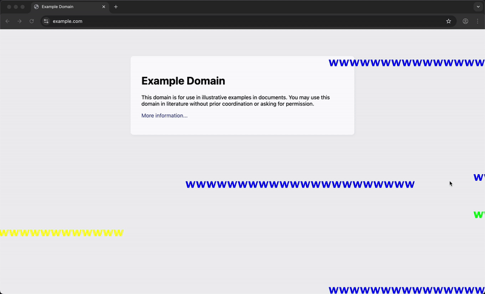

# screen-text-scroller

A Java + Node.js application that reads messages from Discord and scrolls them across your screen.
This is intended for stream overlays or just for fun!

## Getting started

1. Download the [latest release](https://github.com/joeyshi12/screen-text-scroller/releases).
2. Input your Discord bot token in `web/.env`.
3. In the `web` folder, run `npm install` and then `npm run dev`.
4. In a separate terminal, run `java -jar screen-text-scroller.jar`.

